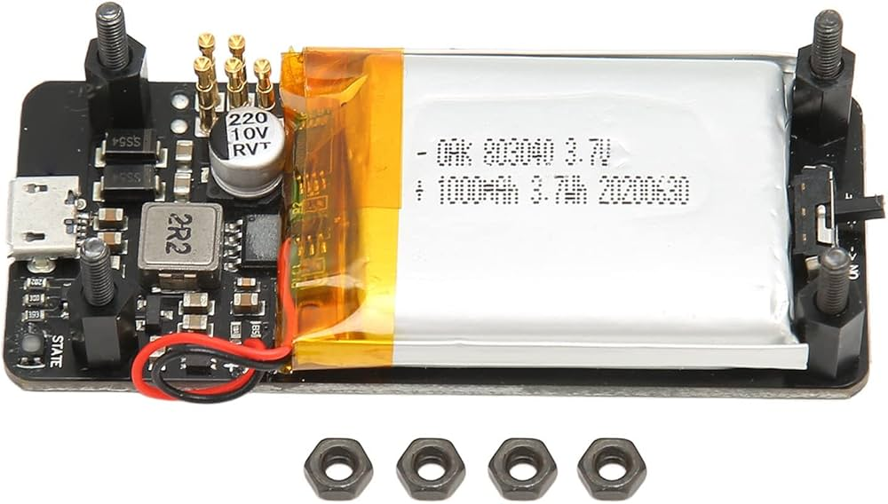

# Pwnagotchi
Pwnagotchi build

Parte de.. fue crear mi propio pwnagotchi, una pequeño review:

#

Ya tenia el raspberry pi zero w y solo compre la pantalla con carcasa:

#

Materiales usados:

- raspberry pi zero w
- memoria SD 64gb
- pantalla waveshare 2.13 e-ink V4 w/case

#

Materiales faltantes:

- Hat de bateria, no lo agregue por que el case solo trae espacio para el pi zero w y el costo.. por lo pronto seria traerlo con un powerbank

#

La pantalla viene con case (muy buen material) incluye:
- 2 thermal pads (el raspberry si genera mucho calor)
- tornillos para fijar el raspberry a la parte inferior de la carcasa
- 4 gomas para la parte externa de la carcasa.

#

**No creare una guia, ya hay muchas en internet mejor aqui te dejo una en español**

[Video en español](https://youtu.be/MijGc9hMg5M)

Aqui su Github para que pases a agradecer:

[Github DavidCano](https://github.com/davidcanoteayuda/Pwnagotchi)

